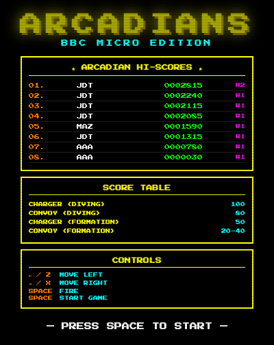

# ARCADIANS — BBC Micro Edition
## A Galaxian-style retro game demo on OpenShift



Faithful clone of the 1982 Acornsoft Arcadians (BBC Micro) — itself a clone of Namco's Galaxian.
Features swooping dive-bombing aliens, authentic BBC palette, extracted original intro music,
and a PostgreSQL high score table. Built as a full Kubernetes demo stack on OpenShift.

---

### Stack

| Component  | Technology                        |
|------------|-----------------------------------|
| Game       | Vanilla HTML5 Canvas + Web Audio  |
| API        | FastAPI (Python 3.12)             |
| Database   | PostgreSQL 16 StatefulSet         |
| Backup     | Kanister non-exclusive BP         |
| Registry   | Harbor (`harbor.apps.openshift2.lab.home`) |
| Platform   | OpenShift (`rke2-prod`)           |
| Namespace  | `retro-game`                      |

---

### Directory Structure

```
arcadians/
├── README.md
├── game/
│   ├── index.html       # Full game — Canvas renderer, Web Audio, score UI
│   ├── nginx.conf       # Proxies /api/ → backend service
│   └── Dockerfile       # nginx:alpine serving static HTML
├── api/
│   ├── main.py          # FastAPI — GET /api/scores, POST /api/scores, GET /healthz
│   ├── requirements.txt # fastapi, uvicorn, asyncpg, pydantic
│   └── Dockerfile       # python:3.12-slim
└── k8s/
    ├── 00-namespace.yaml           # retro-game namespace
    ├── 01-postgresql.yaml          # StatefulSet + headless + ClusterIP + Secret
    ├── 02-api.yaml                 # FastAPI Deployment + Service
    ├── 03-frontend.yaml            # nginx Deployment + Service + OpenShift Route
    └── 04-kanister-actionset.yaml  # Manual backup trigger
```

---

### Game Features

- **Galaxian mechanics** — aliens hold formation sweeping side to side, groups peel off
  and dive-bomb the player in curved paths, shooting as they go
- **Two alien types** — Charger (top rows, high value) and Convoy (formation fillers)
- **Authentic scoring** — Charger diving 100pts, Convoy diving 80pts, formation kills 20-50pts
- **BBC Micro palette** — black, red, green, yellow, blue, magenta, cyan, white only
- **Intro music** — extracted via FFT analysis from original Arcadians BBC Micro audio
- **Sound effects** — Web Audio synthesised: formation march tick, shoot, dive warble,
  alien explosions, layered player death boom with debris animation
- **Player death animation** — ship fragments with expanding debris cloud over 12 frames
- **Mission briefing** — "WE ARE THE ARCADIANS!" screen between waves
- **Hi-score table** — top 8 scores with initials and wave reached, persisted in PostgreSQL
- **Wave progression** — aliens speed up, shoot faster, dive more aggressively each wave

---

### Controls

| Key       | Action                            |
|-----------|-----------------------------------|
| `←` / `Z` | Move left                         |
| `→` / `X` | Move right                        |
| `SPACE`   | Fire                              |
| Any key   | Start intro music (title screen)  |
| `SPACE`   | Skip intro / start game           |

---

### Build & Push Images

```bash
# Game frontend
cd game
docker build -t harbor.apps.openshift2.lab.home/retro-game/arcadians-game:latest .
docker push harbor.apps.openshift2.lab.home/retro-game/arcadians-game:latest

# API backend
cd ../api
docker build -t harbor.apps.openshift2.lab.home/retro-game/arcadians-api:latest .
docker push harbor.apps.openshift2.lab.home/retro-game/arcadians-api:latest
```

---

### Deploy to OpenShift

```bash
# Apply manifests in order
oc apply -f k8s/00-namespace.yaml
oc apply -f k8s/01-postgresql.yaml

# Wait for PostgreSQL to be ready before deploying the API
oc -n retro-game rollout status statefulset/arcadians-postgresql

oc apply -f k8s/02-api.yaml
oc apply -f k8s/03-frontend.yaml

# Check all rollouts
oc -n retro-game rollout status deployment/arcadians-api
oc -n retro-game rollout status deployment/arcadians-game

# Get the route URL
oc -n retro-game get route arcadians
```

---

### OpenShift SCC Note

If the PostgreSQL pod fails to start due to SCC restrictions, grant `anyuid` to the
default service account:

```bash
oc adm policy add-scc-to-user anyuid -z default -n retro-game
```

For a cleaner approach using a dedicated service account:

```bash
oc create sa arcadians-sa -n retro-game
oc adm policy add-scc-to-user anyuid -z arcadians-sa -n retro-game
```

Then add `serviceAccountName: arcadians-sa` to the StatefulSet pod spec in `01-postgresql.yaml`.

---

### PostgreSQL & Kanister Backup

The StatefulSet is labelled to match the `postgres-non-exclusive-backup` Kanister blueprint
already deployed in `kasten-io`. This blueprint uses the PostgreSQL 15+ non-exclusive backup
API (`pg_backup_start` / `pg_backup_stop`).

Key label and naming conventions the blueprint requires:

```
app.kubernetes.io/instance: arcadians          # used to build PGHOST
Secret name: arcadians-postgresql              # must be {{ instance }}-postgresql
Secret key:  postgres-password
```

To trigger a manual backup, set your Kanister profile name in `04-kanister-actionset.yaml`
then apply:

```bash
oc apply -f k8s/04-kanister-actionset.yaml -n kasten-io
oc -n kasten-io get actionset arcadians-postgresql-backup -w
```

---

### ArgoCD Integration

Push the repo to Gitea and create an ArgoCD Application pointing at the `k8s/` directory:

```yaml
apiVersion: argoproj.io/v1alpha1
kind: Application
metadata:
  name: arcadians
  namespace: argocd
spec:
  project: default
  source:
    repoURL: https://YOUR_GITEA/YOUR_ORG/arcadians.git
    targetRevision: HEAD
    path: k8s
  destination:
    server: https://kubernetes.default.svc
    namespace: retro-game
  syncPolicy:
    automated:
      prune: true
      selfHeal: true
```

---

### API Reference

| Method | Path          | Description                         |
|--------|---------------|-------------------------------------|
| GET    | `/api/scores` | Top 10 scores ordered by score desc |
| POST   | `/api/scores` | Submit a new score                  |
| GET    | `/healthz`    | Liveness/readiness health check     |

POST request body:
```json
{ "initials": "JTT", "score": 12340, "wave": 5 }
```

The `scores` table is created automatically on API startup if it does not exist.

---

### Architecture Notes

The nginx frontend container proxies all `/api/` requests to the `arcadians-api` ClusterIP
service, so the game only needs a single exposed Route. The API connects to PostgreSQL using
the `arcadians-postgresql` ClusterIP service within the same namespace — no external database
exposure required.

The entire stack is self-contained within the `retro-game` namespace and can be torn down
cleanly with `oc delete namespace retro-game`.
